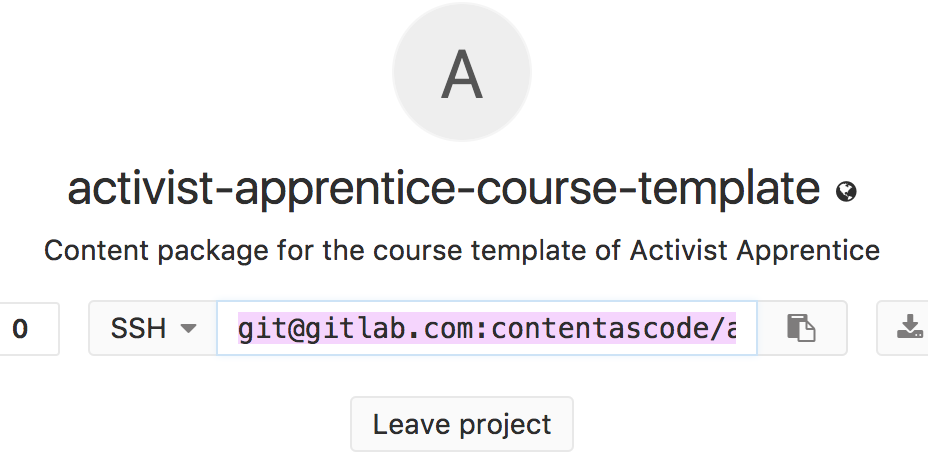

# Forking from GitLab

In order to save your work on Gitlab you need to create a fork using this link:

https://gitlab.com/contentascode/activist-apprentice-course-template/forks/new

Then setup the content package so that it refers to the fork by doing:

* `git remote remove origin`
* `git remote add origin URL_OF_YOUR_FORK` that's the URL on the home page of the Gitlab page for the project.

You can now use the exact same manual steps as described for `apprentice load` and `apprentice save`!

---
