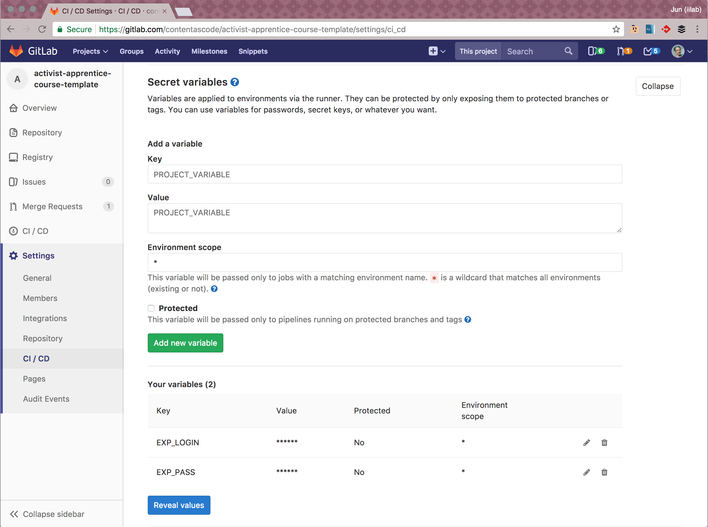

# Connecting Your Course on GitLab to Expo.io

You can setup the mobile preview pipeline by going into the gitlab settings for your project, CI/CD, then expand the Secret Variables and add EXP_LOGIN and EXP_PASS with your credentials.

As long as:
* the app builds correctly
  * You've tested it locally on your machine with `apprentice start`
* the `.gitlab-ci.yml` file is in the repo
* the `preview.yml` file is updated
* the credentials are correct

then the app should be published in expo.

---
